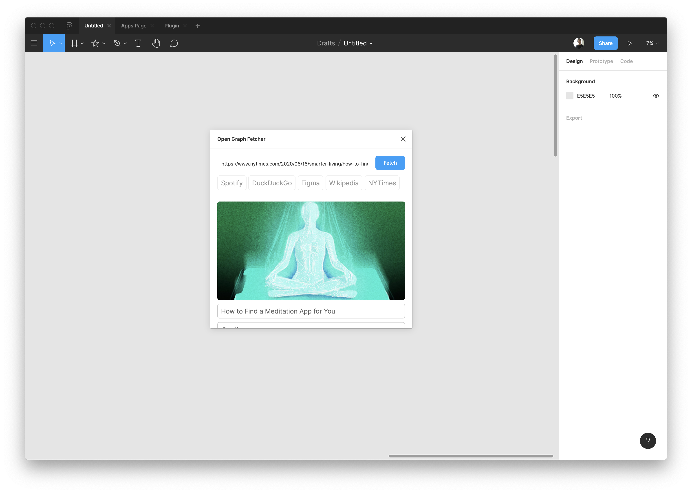

# Figma Open Graph Plugin
A Figma plugin that pulls in Open Graph information from websites. Requires https://github.com/jagtalon/figma-open-graph-server

## How to build:
- Run `npm install`
- Run `npx webpack --mode=development --watch` for development or `npx webpack --mode=production` for production.
